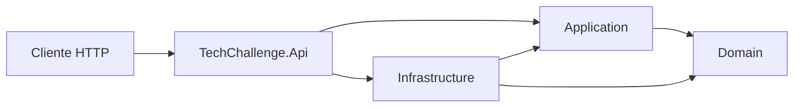

# .NET System Architecture

[](https://dotnet.microsoft.com/)
[](#arquitetura-inicial)
[](#roadmap)

Repositório de estudos e projetos práticos de **Arquitetura de Sistemas .NET**, organizado com base na jornada da Pós Tech FIAP + Alura.

> Projeto pessoal de **Gabriel Lacerda**. Este repositório não é oficial da FIAP e não distribui material proprietário do curso.

## Objetivo

Consolidar, em um único repositório, estudos e implementações sobre:

- Domain-Driven Design, APIs e qualidade de software;
- microsserviços, contêineres, Kubernetes e mensageria;
- arquitetura hexagonal, serverless, observabilidade, NoSQL, CQRS e Event Sourcing;
- DevOps, cloud, GitHub Actions e Elasticsearch;
- SOLID, segurança, LGPD, Blazor e Inteligência Artificial aplicada ao .NET.

## Estrutura

```text
.
├── .github/workflows/       # Integração contínua
├── docs/                    # Roadmap, ADRs e documentação arquitetural
├── phases/                  # Estudos organizados pelas cinco fases
├── src/
│   ├── TechChallenge.Api
│   ├── TechChallenge.Application
│   ├── TechChallenge.Domain
│   └── TechChallenge.Infrastructure
├── tests/
│   ├── TechChallenge.UnitTests
│   └── TechChallenge.IntegrationTests
├── docker-compose.yml
├── Directory.Build.props
├── global.json
└── NET-System-Architecture.sln
```

## Arquitetura inicial

O projeto começa como um **monólito modular com Clean Architecture**, evitando a criação prematura de microsserviços.



### Responsabilidades

| Projeto | Responsabilidade |
|---|---|
| `Domain` | Entidades, regras de negócio e contratos centrais |
| `Application` | Casos de uso, DTOs, comandos, consultas e portas |
| `Infrastructure` | Persistência, mensageria, cache e integrações externas |
| `Api` | Endpoints, autenticação, middlewares e composição da aplicação |
| `UnitTests` | Testes isolados de domínio e aplicação |
| `IntegrationTests` | Testes da API e integrações reais/controladas |

## Executando localmente

### Pré-requisitos

- .NET SDK 10;
- Docker Desktop, para os componentes de infraestrutura;
- Git.

### Comandos

```bash
dotnet restore
dotnet build
dotnet test
dotnet run --project src/TechChallenge.Api
```

A API ficará disponível conforme o endereço exibido pelo ASP.NET Core. O endpoint inicial é:

```http
GET /health
```

### Docker

```bash
docker compose up --build
```

## Roadmap

A trilha completa está em [`docs/ROADMAP.md`](docs/ROADMAP.md).

| Fase | Tema central | Entrega prática sugerida |
|---|---|---|
| 1 | Arquitetura e Qualidade | API modular com DDD, EF/Dapper, autenticação e testes |
| 2 | Microsserviços e Containers | Extração de serviços, mensageria, Docker e Kubernetes |
| 3 | Serverless e Monitoramento | Funções, gateway, observabilidade, NoSQL e CQRS |
| 4 | DevOps e Cloud | CI/CD, Azure/AWS, GitHub Actions e Elasticsearch |
| 5 | Agilidade, Segurança e IA | LGPD, Blazor, Semantic Kernel e consolidação arquitetural |

## Padrões adotados

- Nullable reference types;
- warnings tratados como erros;
- versionamento central das configurações de build;
- APIs mínimas como ponto de entrada;
- dependências direcionadas para o domínio;
- documentação arquitetural por ADR;
- testes automatizados no pipeline.

## Convenções de branches e commits

Branches:

```text
feature/nome-da-funcionalidade
fix/nome-da-correcao
docs/nome-da-documentacao
chore/nome-da-tarefa
```

Commits:

```text
feat: adiciona cadastro de cliente
fix: corrige validação de documento
test: adiciona testes do caso de uso
docs: registra decisão arquitetural
chore: atualiza pipeline
```

## Fonte da trilha

A organização das fases foi inspirada na grade pública da Pós Tech **Arquitetura de Sistemas .NET**, da FIAP + Alura:

- https://postech.fiap.com.br/curso/arquitetura-sistemas-net

## Licença

Uso educacional e pessoal. Consulte [`LICENSE`](LICENSE).
